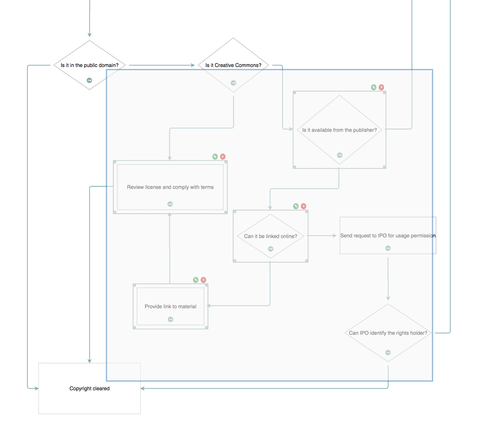

<a name="top"></a>
## Flowchart Builder (React)

This is a port of the Flowchart Builder application that demonstrates the Toolkit's React integration.


This page gives you an in-depth look at how the application is put together.

<a name="babel-setup"></a>
### Babel Setup

This demonstration uses JSX files and ES2015. To transpile these to ES5, we use Babel.

These are the `package.json` entries we use:

```javascript
"devDependencies":{

    ...

    "babel-core": "^6.22.1",
    "babel-loader": "^6.2.10",
    "babel-preset-es2015": "^6.22.0",
    "babel-preset-react": "^6.22.0",

    ...
}
```

[TOP](#top)

---

<a name="package-json"></a>
### package.json

This is the full `package.json` for the demonstration:


```javascript
{
  "name": "jsplumbtoolkit-react",
  "version": "*.*.*",
  "description": "Integration between jsPlumb Toolkit and React",
  "main": "index.js",
  "author": "jsPlumb <hello@jsplumbtoolkit.com> (https://jsplumbtoolkit.com)",
  "license": "Commercial",
  "scripts": {
    "build": "node ./node_modules/webpack/bin/webpack.js"
  },
  "dependencies": {
    "react": "^16.0.0",
    "react-dom": "^16.0.0",
    "font-awesome": "^4.7.0",
    "jsplumbtoolkit": "file:../../jsplumbtoolkit.tgz",
    "jsplumbtoolkit-react": "file:../../jsplumbtoolkit-react.tgz",
    "jsplumbtoolkit-undo-redo": "file:../../jsplumbtoolkit-undo-redo.tgz"
  },
  "devDependencies": {
    "babel-core": "^6.22.1",
    "babel-loader": "^6.2.10",
    "babel-preset-es2015": "^6.22.0",
    "babel-preset-react": "^6.22.0",
    "webpack": "^2.4.1",
    "webpack-dev-server": "^2.4.1"
  }
}


```

Note that we import the jsPlumb Toolkit and its React integration via local file references to their respective packages, which are included in licensed (and evaluation) downloads.


[TOP](#top)

---

<a name="webpack-setup"></a>
### Webpack Setup

This is the config file we use to setup Webpack to bundle our demonstration:

```javascript
var path = require('path');
var webpack = require('webpack');
 
module.exports = {
  entry: './src/index.jsx',
  output: { 
      path: path.join(__dirname, "dist"), 
      filename: 'bundle.js' 
    },
  module: {
    loaders: [
      {
        test: /.jsx?$/,
        loader: 'babel-loader',
        query: {
          presets: ['es2015', 'react']
        }
      }
    ]
  },
};
```

[TOP](#top)

---


<a name="setup"></a>
### Page Setup

#### CSS

```xml
<link rel="stylesheet" href="node_modules/font-awesome/css/font-awesome.min.css">
<link rel="stylesheet" href="node_modules/jsplumbtoolkit/dist/css/jsplumbtoolkit-defaults.css">
<link rel="stylesheet" href="node_modules/jsplumbtoolkit/dist/css/syntax-highlighter.css">
<link rel="stylesheet" href="node_modules/jsplumbtoolkit/dist/css/jsplumbtoolkit-demo.css">

<link rel="stylesheet" href="app.css">

```
Font Awesome, `jsplumbtoolkit-demo.css`, and `app.css` are used for this demo and are not jsPlumb Toolkit requirements. `jsplumbtoolkit-defaults.css` is recommended for 
all apps using the Toolkit, at least when you first start to build your app. This stylesheet contains sane defaults for the various widgets in the Toolkit.

#### JS

We use Webpack to create a bundle for the demonstration - JS dependencies are the `dependencies` section of `package.json`:

```javascript
"dependencies": {
    "react": "^16.0.0",
    "react-dom": "^16.0.0",
    "jsplumbtoolkit": "file:../../jsplumbtoolkit.tgz",
    "jsplumbtoolkit-react": "file:../../jsplumbtoolkit-react.tgz"
}
```

jsPlumb has been tested against versions `15.4.2`, `15.5.0` and `16.0.0` of React.

[TOP](#top)

---
<a name="demo-component"></a>
### Demo Component

The entry point to the demonstration is `index.jsx`. It consists of a `DemoComponent`, which is rendered as follows:

```javascript
ReactDOM.render(<DemoComponent/>, document.querySelector(".jtk-demo-canvas"));
```

<a name="demoComponentCode"></a>
#### Implementation

This is the code for the demo component:

```javascript
class DemoComponent extends React.Component {

    constructor(props) {
        super(props);
        this.toolkit = jsPlumbToolkit.newInstance({
            nodeFactory: function (type, data, callback) {
                Dialogs.show({
                    id: "dlgText",
                    title: "Enter " + type + " name:",
                    onOK:  (d) => {
                        data.text = d.text;
                        // if the user entered a name...
                        if (data.text) {
                            // and it was at least 2 chars
                            if (data.text.length >= 2) {
                                // set an id and continue.
                                data.id = jsPlumbUtil.uuid();
                                callback(data);
                            }
                            else
                            // else advise the user.
                                alert(type + " names must be at least 2 characters!");
                        }
                        // else...do not proceed.
                    }
                });
            },
            beforeStartConnect:(node, edgeType) => {
                // limit edges from start node to 1. if any other type of node, return
                return (node.data.type === "start" && node.getEdges().length > 0) ? false : { label:"..." };
            }
        });

        this.view = {
            nodes: {
                "start": {
                   component:StartComponent
                },
                "selectable": {
                    events: {
                        tap:  (params) => {
                            this.toolkit.toggleSelection(params.node);
                        }
                    }
                },
                "question": {
                    parent: "selectable",
                    component:QuestionComponent
                },
                "action": {
                    parent: "selectable",
                    component:ActionComponent
                },
                "output":{
                    parent:"selectable",
                    component:OutputComponent
                }
            },
            // There are two edge types defined - 'yes' and 'no', sharing a common
            // parent.
            edges: {
                "default": {
                    anchor:"AutoDefault",
                    endpoint:"Blank",
                    connector: ["Flowchart", { cornerRadius: 5 } ],
                    paintStyle: { strokeWidth: 2, stroke: "#f76258", outlineWidth: 3, outlineStroke: "transparent" },	//	paint style for this edge type.
                    hoverPaintStyle: { strokeWidth: 2, stroke: "rgb(67,67,67)" }, // hover paint style for this edge type.
                    events: {
                        "dblclick":  (params) => {
                            Dialogs.show({
                                id: "dlgConfirm",
                                data: {
                                    msg: "Delete Edge"
                                },
                                onOK: () => {
                                    this.toolkit.removeEdge(params.edge);
                                }
                            });
                        }
                    },
                    overlays: [
                        [ "Arrow", { location: 1, width: 10, length: 10 }],
                        [ "Arrow", { location: 0.3, width: 10, length: 10 }]
                    ]
                },
                "connection":{
                    parent:"default",
                    overlays:[
                        [ "Label", {
                            label: "${label}",
                            events:{
                                click:(params) => {
                                    this._editLabel(params.edge);
                                }
                            }
                        }]
                    ]
                }
            },
            ports: {
                "start": {
                    edgeType: "default"
                },
                "source": {
                    maxConnections: -1,
                        edgeType: "connection"
                },
                "target": {
                    maxConnections: -1,
                        isTarget: true,
                        dropOptions: {
                        hoverClass: "connection-drop"
                    }
                }
            }
        }

        this.renderParams = {
            // Layout the nodes using an absolute layout
            layout: {
                type: "Absolute"
            },
            events: {
                canvasClick: (e) => {
                    this.toolkit.clearSelection();
                },
                edgeAdded:(params) => {
                    if (params.addedByMouse) {
                        this._editLabel(params.edge, true);
                    }
                }
            },
            lassoInvert:true,
            consumeRightClick: false,
            dragOptions: {
                filter: ".jtk-draw-handle, .node-action, .node-action i"
            }
        }
    }

    render() {
        return <div style={{width:"100%",height:"100%"}}>
                    <JsPlumbToolkitSurfaceComponent renderParams={this.renderParams} toolkit={this.toolkit} view={this.view} ref={ (c) => this.surface = c.surface }/>
                    <ControlsComponent ref={(c) => this.controls = c }/>
                    <DatasetComponent ref={(d) => this.dataset = d }/>
                    <div className="miniview"/>                        
                </div>
    }

    typeExtractor (el) { return el.getAttribute("data-node-type"); }
    dataGenerator (type) { return { w:120, h:80 }; }

    componentDidMount() {
        this.toolkit.load({url:"data/flowchart-1.json"});
        this.controls.initialize(this.surface);
        this.dataset.initialize(this.surface);
        new jsPlumbToolkit.DrawingTools({
            renderer: this.surface
        });

        ReactDOM.render(
            <DemoNodePalette surface={this.surface} selector={"div"} typeExtractor={this.typeExtractor} container={nodePaletteElement} dataGenerator={this.dataGenerator}/>
            , document.querySelector(".node-palette"));

        ReactDOM.render(
            <JsPlumbToolkitMiniviewComponent surface={this.surface}/>, document.querySelector(".miniview")
        )
    }

    _editLabel (edge, deleteOnCancel) {
        Dialogs.show({
            id: "dlgText",
            data: {
                text: edge.data.label || ""
            },
            onOK: (data) => {
                this.toolkit.updateEdge(edge, { label:data.text || "" });
            },
            onCancel:() => {
                if (deleteOnCancel) {
                    this.toolkit.removeEdge(edge);
                }
            }
        });
    }
}
```

This component has a few different responsibilities:

##### 1. Creating an instance of the Toolkit

```javascript
this.toolkit = jsPlumbToolkit.newInstance({
    nodeFactory: function (type, data, callback) {
        Dialogs.show({
            id: "dlgText",
            title: "Enter " + type + " name:",
            onOK:  (d) => {
                data.text = d.text;
                // if the user entered a name...
                if (data.text) {
                    // and it was at least 2 chars
                    if (data.text.length >= 2) {
                        // set an id and continue.
                        data.id = jsPlumbUtil.uuid();
                        callback(data);
                    }
                    else
                    // else advise the user.
                        alert(type + " names must be at least 2 characters!");
                }
                // else...do not proceed.
            }
        });
    },
    beforeStartConnect:(node, edgeType) => {
        // limit edges from start node to 1. if any other type of node, return
        return (node.data.type === "start" && node.getEdges().length > 0) ? false : { label:"..." };
    }
});
```

We provide a `nodeFactory`, which is a function that jsPlumb calls when a new node is dropped onto the canvas. The node factory
is given the type of the node and any initial data (that was created via the `dataGenerator` plugged in to the drag/drop mechanism),
and a callback function that should be called with the given data if the factory wishes to proceed. In our implementation we popup a dialog
prompting the user for a node name, and if that name is two or more characters in length, we generate a random ID and hit the callback. If the
name is less than two characters in length we do not proceed.

We also provide a `beforeStartConnect` function, which returns an object. This object is used as the initial data for the edge that is
being drawn.


##### 2. Rendering child components

The Surface, controls and dataset components are rendered in the demo component's `render` method:

```javascript
render() {
    return <div style={{width:"100%",height:"100%"}}>
                <JsPlumbToolkitSurfaceComponent renderParams={this.renderParams} toolkit={this.toolkit} view={this.view} ref={ (c) => this.surface = c.surface }/>
                <ControlsComponent ref={(c) => this.controls = c }/>
                <DatasetComponent ref={(d) => this.dataset = d }/>
                <div className="miniview"/>                        
            </div>
}
```

`JsPlumbToolkitSurfaceComponent` is discussed [here](react-integration#surface-component). Note that in this
demo we use `ref={ (c) => this.surface = c.surface }` on its declaration in order to get
a reference to the component - we have to pass it in to various others. 

`ControlsComponent` is a small helper component created to offer buttons for zoom, lasso mode, and undo/redo. It isn't 
part of the Toolkit's React integration, but it is production ready and can be used if you want to use it.

`DatasetComponent` is a React version of the dataset view you may have een in other Toolkit demonstrations.

The miniview and palette components are created inside `componentDidMount()`:

```javascript
componentDidMount() {
    this.toolkit.load({url:"data/flowchart-1.json"});
    this.controls.initialize(this.surface);
    this.dataset.initialize(this.surface);
    new jsPlumbToolkit.DrawingTools({
        renderer: this.surface
    });

    ReactDOM.render(
        <DemoNodePalette surface={this.surface} selector={"div"} typeExtractor={this.typeExtractor} container={nodePaletteElement} dataGenerator={this.dataGenerator}/>
        , document.querySelector(".node-palette"));

    ReactDOM.render(
        <JsPlumbToolkitMiniviewComponent surface={this.surface}/>, document.querySelector(".miniview")
    )
}
```

We do this because we know `componentDidMount()` won't be called until the Surface
component has been created, and we need the Surface component for the miniview and node
palette constructors, and also to initialize our controls.

##### 3. Initialise the drawing tools

This occurs in `componentDidMount()`, because, again, we need a reference to the Surface widget
before we can initialise the drawing tools:

```
new jsPlumbToolkit.DrawingTools({
    renderer: this.surface
});
```

##### 4. Load the initial dataset

```javascript
componentDidMount() {
    this.toolkit.load({url:"data/flowchart-1.json"});
    ...
}
```


##### 5. Edit the label of an edge

`_editLabel` is a method declared on the demo component class:

```
_editLabel (edge, deleteOnCancel) {
    Dialogs.show({
        id: "dlgText",
        data: {
            text: edge.data.label || ""
        },
        onOK: (data) => {
            this.toolkit.updateEdge(edge, { label:data.text || "" });
        },
        onCancel:() => {
            if (deleteOnCancel) {
                this.toolkit.removeEdge(edge);
            }
        }
    });
}
```

It is called in two places. For existing edges, it is called when the user clicks the label. This
is wired up in the view:

```javascript
edges: {
    ...
    
    "connection":{
        parent:"default",
        overlays:[
            [ "Label", {
                label: "${label}",
                events:{
                    click:(params) => {
                        this._editLabel(params.edge);
                    }
                }
            }]
        ]
    }
}
```

For new edges, it is called when the component receives an `edgeAdded` event:

```javascript
this.renderParams = {
    // Layout the nodes using an absolute layout
    layout: {
        type: "Absolute"
    },
    events: {
        canvasClick: (e) => {
            this.toolkit.clearSelection();
        },
        edgeAdded:(params) => {
            if (params.addedByMouse) {
                this._editLabel(params.edge, true);
            }
        }
    },
    lassoInvert:true,
    consumeRightClick: false,
    dragOptions: {
        filter: ".jtk-draw-handle, .node-action, .node-action i"
    }
}
```

We pass in `true` for the second argument here, meaning the edge is new. `_editLabel` will
discard an edge if the user presses cancel on the dialog and this flag was set to true.


<a name="node-components"></a>
#### Node Components

There are four components used to render nodes - one each for the node types of `Question`, `Action` and `Output`, and one 
for the `Start` node.  The Output, Action and Question node components all extend the [BaseEditableNodeComponent](#base-editable-node), which itself extends the
Toolkit's `BaseNodeComponent`. You must ensure your node components extend `BaseNodeComponent`.

##### StartComponent

```
import React from 'react';
import { BaseNodeComponent } from"jsplumbtoolkit-react";

/**
 * Component used to render a start node.
 */
export class StartComponent extends BaseNodeComponent {

    constructor(props) {
        super(props)
    }

    render() {

        const obj = this.state;

        return <div style={{width:obj.w + 'px', height:obj.h + 'px'}} className="flowchart-object flowchart-start">
            <div style={{position:'relative'}}>
                <svg width={obj.w} height={obj.h}>
                    <ellipse cx={obj.w / 2} cy={obj.h / 2} rx={obj.w / 2} ry={obj.h / 2} className="outer"/>
                    <ellipse cx={obj.w / 2} cy={obj.h / 2} rx={(obj.w /2) - 10} ry={(obj.h/2) - 10} className="inner"/>
                    <text textAnchor="middle" x={obj.w / 2} y={ obj.h / 2 } dominantBaseline="central">{obj.text}</text>
                </svg>
            </div>
            <jtk-source port-type="start" filter=".outer" filter-negate="true"/>
        </div>
    }
}
```

The **Start** node consists of an ellipse with a text label centered inside of it. Note that all references to the node data that is being rendered are prefixed 
with `obj.`. For instance, the first line in the template here is:

```xml
<div style={{left:obj.left + 'px', top:obj.top + 'px', width:obj.w + 'px', height:obj.h + 'px'}} className="flowchart-object flowchart-start">
```

React expects one root element per template. 

The `jtk-source` element declares that this node is an edge source, of type `start` (the `port-type` attribute 
specifies this).  The `filter` attribute instructs the Toolkit to enable drag only from some element that is not a 
child of an `svg` element, but then `filter-negate` is `true`: the result is that dragging will begin only from a 
descendant of the `svg` element. What this means visually is that the user will not be able to start a drag from the 
whitespace surrounding the ellipse.


##### QuestionComponent


import React from 'react';
import { BaseEditableComponent } from"./base-component.jsx";

/**
 * Component used to render a Question node.
 */
export class QuestionComponent extends BaseEditableComponent {

    constructor(props) {
        super(props);
    }

    render() {

        const obj = this.state;

        return <div style={{width:obj.w + 'px', height:obj.h + 'px'}} className="flowchart-object flowchart-question">
            <div style={{position:'relative'}}>
                <div className="node-edit node-action" onClick={this.edit.bind(this)}>
                    <i className="fa fa-pencil-square-o"/>
                </div>
                <div className="node-delete node-action" onClick={this.remove.bind(this)}>
                    <i className="fa fa-times"/>
                </div>
                <svg width={obj.w} height={obj.h}>
                    <path d={'M' +  (obj.w/2) + ' 0 L ' + obj.w + ' ' +  (obj.h/2) + ' L ' + (obj.w/2) + ' ' + obj.h + '  L 0 ' + (obj.h/2) + '  Z'} className="outer"/>
                    <path d={'M' +  (obj.w/2) + ' 10 L ' + (obj.w - 10) + ' ' +  (obj.h/2) + ' L ' + (obj.w/2) + ' ' + (obj.h - 10) + '  L 10 ' + (obj.h/2) + '  Z'} className="inner"/>
                    <text textAnchor="middle" x={obj.w/2} y={obj.h/2} dominantBaseline="central">{obj.text}</text>
                </svg>
            </div>
            <jtk-source port-type="source" filter=".outer"/>
            <jtk-target port-type="target"/>
        </div>
    }
}

The `Question` node draws a diamond, and declares itself to be an edge target and source.  


##### ActionComponent

```javascript
import React from 'react';
import { BaseEditableComponent } from"./base-component.jsx";

/**
 * Component used to render an action node.
 */
export class ActionComponent extends BaseEditableComponent {

    constructor(props) {
        super(props)
    }

    render() {

        const obj = this.state;

        return <div style={{width:obj.w + 'px', height:obj.h + 'px'}} className="flowchart-object flowchart-action">
            <div style={{position:'relative'}}>
                <div className="node-edit node-action" onClick={this.edit.bind(this)}>
                    <i className="fa fa-pencil-square-o"/>
                </div>
                <div className="node-delete node-action" onClick={this.remove.bind(this)}>
                    <i className="fa fa-times"/>
                </div>
                <svg width={obj.w} height={obj.h}>
                    <rect x={0} y={0} width={obj.w} height={obj.h} className="outer drag-start"/>
                    <rect x={10} y={10} width={obj.w-20} height={obj.h-20} className="inner"/>
                    <text textAnchor="middle" x={obj.w/2} y={obj.h/2} dominantBaseline="central">{obj.text}</text>
                </svg>
            </div>
            <jtk-target port-type="target"/>
            <jtk-source port-type="source" filter=".outer"/>
        </div>
    }
}
```

Once again we use the position and dimensions for the node's main container as well as its SVG elements. `Action` nodes are 
configured as both edge sources and targets.

##### OutputComponent

```javascript
import React from 'react';
import { BaseEditableComponent } from"./base-component.jsx";

/**
 * Component used to render an output node.
 */
export class OutputComponent extends BaseEditableComponent {

    constructor(props) {
        super(props)
    }

    render() {

        const obj = this.state;

        return <div style={{width:obj.w + 'px', height:obj.h + 'px'}} className="flowchart-object flowchart-output">
            <div style={{position:'relative'}}>
                <div className="node-edit node-action" onClick={this.edit.bind(this)}>
                    <i className="fa fa-pencil-square-o"/>
                </div>
                <div className="node-delete node-action" onClick={this.remove.bind(this)}>
                    <i className="fa fa-times"/>
                </div>
                <svg width={obj.w} height={obj.h}>
                    <rect x={0} y={0} width={obj.w} height={obj.h}/>
                    <text textAnchor="middle" x={obj.w/2} y={obj.h/2} dominantBaseline="central">{obj.text}</text>
                </svg>
            </div>
            <jtk-target port-type="target"/>
        </div>
    }
}
```

The `Output` node is configured to be a connection target only.

[TOP](#top)

---

<a name="resizedrag"></a>
### Resizing/Dragging Nodes

To resize or drag a node first you must either click on it, or use the lasso (described [below](#selecting)) to select 
it.  A selected node looks like this:


The dotted line and drag handles that are added to a selected Node are put there by the Tookit's drawing tools. It 
listens to the Toolkit's select/deselect events and 
decorates UI elements accordingly. These tools are discussed in detail on [this page](drawing).

The drawing tools are initialized with this line of code (inside the `componentDidMount()` method of the demo component):

```javascript
new jsPlumbToolkit.DrawingTools({
    renderer: this.surface
});
```

You pass them the instance of the Surface widget you're working with.

#### Dragging

Nodes can be dragged only by the square in the center of the node. This is achieved by setting a `filter` on the 
`dragOptions` parameter in the `renderParams`:

```javascript
dragOptions: {
  handle: ".jtk-draw-drag"
}
```

`jtk-draw-drag` is the classname of the square that the drawing tools place in the center of a selected node.

#### Resizing

Resizing is handled automatically by the drawing tools.  By default, these tools will change the `w`, `h`, `left` and `top` values in a node's data, but this can be changed.

When a node's data is updated the drawing tools call the appropriate update method on the underlying Toolkit. The changes 
will be reflected immediately in the DOM.

[TOP](#top)

---

<a name="selecting"></a>
### Selecting Nodes

#### Left Click

Nodes can be selected with a left-click (or tap on a touch device; `tap` is a better event to choose in general because the
Toolkit abstracts out the difference between mouse devices and touch devices and presents `click` events as `tap` events
on non touch devices).  This is configured in the `view` parameter to the `render` call. In this application, 
Nodes of type _selectable_ have the capability enabled with this code:

```javascript
"selectable": {
  events: {
    tap: (params) => {
      this.toolkit.toggleSelection(params.node);
    }
  }
}
```

The `tap` event (discussed [here](widget-surface#eventlist)) is preferable to `click`, as it ensures the application responds only to true clicks on devices with a mouse, and also avoids the delay that some vendors introduce to a click event on touch devices.

#### Lasso Selection

Lasso selection is enabled by default on the Surface widget.  To activate the lasso, click the pencil icon in the toolbar:


This icon (and the others in the toolbar) are rendered by the [ControlsComponent](#controls-component)


#### Lasso Operation

The lasso works in two ways: when you drag from left to right, any node that intersects your lasso will be selected.  When you drag from right to left, only nodes that are enclosed by your 
lasso will be selected.



#### Exiting Select Mode

The Surface widget automatically exits select mode once the user has selected something. The `jsplumb-controls` component also 
listen to clicks on the whitespace in the widget (in the flowchart component) and when one is detected, it clears the
 current selection in the underlying Toolkit:

```javascript
ngAfterViewInit() {
    ...
    this.surface.bind("canvasClick", () => this.surface.getToolkit().clearSelection());
    ...
}
```

#### Zoom To Fit

The controls component also provides the "zoom to fit" button (as shown in the component declaration discussed above).

#### Undo/redo

The controls component attaches an [Undo/redo manager](https://docs.jsplumbtoolkit.com/toolkit/current/articles/undo-redo) to the underlying Toolkit instance, to offer undo/redo support for node, group, port and edge additions and/or removals.
 
 
[TOP](#top)

---

<a name="dataset-component"></a>
### Dataset Component

This component dumps the current contents of the dataset in syntax highlighted json. This component can be found in the file `dataset-component.jsx`.


#### Declaration

```
import React from 'react';
import ReactDOM from "react-dom";

export class DatasetComponent extends React.Component {

    _syntaxHighlight(json) {
        json = json.replace(/&/g, '&amp;').replace(/</g, '&lt;').replace(/>/g, '&gt;');
        return "<pre>" + json.replace(/("(\\u[a-zA-Z0-9]{4}|\\[^u]|[^\\"])*"(\s*:)?|\b(true|false|null)\b|-?\d+(?:\.\d*)?(?:[eE][+\-]?\d+)?)/g,  (match) => {
            let cls = 'number';
            if (/^"/.test(match)) {
              if (/:$/.test(match)) {
                cls = 'key';
              } else {
                cls = 'string';
              }
            } else if (/true|false/.test(match)) {
              cls = 'boolean';
            } else if (/null/.test(match)) {
              cls = 'null';
            }
            return '<span class="' + cls + '">' + match + '</span>';
          }) + "</pre>";
      }

    constructor(props) {
        super(props)
    }

    render() {
        return <div className="jtk-demo-dataset"></div>
    }

    updateDataset() {
        let json = this._syntaxHighlight(JSON.stringify(this.toolkit.exportData(), null, 2));
        ReactDOM.findDOMNode(this).innerHTML = json;
      }

    initialize(surface) {
        this.toolkit = surface.getToolkit();
        this.toolkit.bind("dataUpdated", () => {
            this.updateDataset();
        });
        this.updateDataset();
    }
}
```

This component binds to the Toolkit's `dataUpdated` method, which is fired whenever any change is made to the data model. When an update occurs,
the data set is exported, converted to syntax highlighted json, and then rendered into the component's DOM node.

[TOP](#top)

---

<a name="controls-component"></a>
### Controls Component

This component offers pan/zoom, lasso and undo/redo functionality. As discussed above, it was created for this demonstration, but it is production ready and you
can use it in your own applications if you want to. Note that it does assume that FontAwesome is available in the page.

#### Declaration

```
import React from 'react';

import { jsPlumbToolkitUndoRedo } from 'jsplumbtoolkit-undo-redo';

export class ControlsComponent extends React.Component {

    constructor(props) {
        super(props)
    }

    render() {
        return <div className="controls" ref={(c) => this._container = c}>
            <i className="fa fa-arrows selected-mode" data-mode="pan" title="Pan Mode" onClick={this.panMode.bind(this)}></i>
            <i className="fa fa-pencil" data-mode="select" title="Select Mode" onClick={this.selectMode.bind(this)}></i>
            <i className="fa fa-home" data-reset title="Zoom To Fit" onClick={this.reset.bind(this)}></i>
            <i className="fa fa-undo" undo="true" title="Undo last action" onClick={this.undo.bind(this)}></i>
            <i className="fa fa-repeat" redo="true" title="Redo last action" onClick={this.redo.bind(this)}></i>
        </div>
    }

    initialize(surface) {
        this.surface = surface;
        this.toolkit = surface.getToolkit();
        this.undoManager = new jsPlumbToolkitUndoRedo({
            toolkit:this.toolkit,
            compound:true,
            onChange:(mgr, undoCount, redoCount) => {
                this._container.setAttribute("can-undo", undoCount > 0);
                this._container.setAttribute("can-redo", redoCount > 0);
            }
        });

        this.surface.bind("mode", (mode) => {
            jsPlumb.removeClass(this._container.querySelectorAll("[data-mode]"), "selected-mode");
            jsPlumb.addClass(this._container.querySelectorAll("[data-mode='" + mode + "']"), "selected-mode");
        });
    }

    reset() {
        this.toolkit.clearSelection();
        this.surface.zoomToFit();
    }

    panMode() {
        this.surface.setMode("pan");
    }

    selectMode() {
        this.surface.setMode("select");
    }

    undo() {
        this.undoManager.undo();
    }

    redo() {
        this.undoManager.redo();
    }
}
```

[TOP](#top)
---


<a name="dragging"></a>
### Dragging new nodes

New nodes can be dragged from the list of items on the left either onto the canvas whitespace, to add a node with no initial connections, or onto an existing edge, to insert the new node in between the two nodes of the edge onto which it was dropped.

There are two parts to this:
 
#### DragDropNodeSource component declaration
 
We declare a `DragDropNodeSource` component in `drag-drop-node-source.jsx`. This component extends the `JsPlumbToolkitDragDropComponent` which
is provided in the `jsplumbtoolkit-react-drop` package. The source for this component is:

```javascript
import React from 'react';

import {JsPlumbToolkitDragDropComponent} from 'jsplumbtoolkit-react-drop';

class DragDropNodeSource extends JsPlumbToolkitDragDropComponent {
    render() {
        return <div>
            <div data-node-type="question" title="Drag to add new" className="sidebar-item">
                <i className="icon-tablet"></i>Question
            </div>
            <div data-node-type="action" title="Drag to add new" className="sidebar-item">
                <i className="icon-eye-open"></i>Action
            </div>
            <div data-node-type="output" title="Drag to add new" className="sidebar-item">
                <i className="icon-eye-open"></i>Output
            </div>
        </div>
    }
}

export default DragDropNodeSource;
```

It extends `JsPlumbToolkitDragDropComponent`, which is provided in the React wrapper for the drop manager.  This is an abstract class which has no implementation of the `render` method - you are expected to provide it.

In this component we write out a container div that has three children - one for each of the node types Action, Question and Output.

#### DragDropNodeSource component instantiation

The second piece of setup is the creation of an instance of the `DragDropNodeSource` component. This occurs inside the `componentDidMount()` method of `index.jsx`:

```javascript
ReactDOM.render(
    <DragDropNodeSource
        surface={this.surface}
        selector={"div"}
        container={nodePaletteElement}
        dataGenerator={this.dataGenerator}
        onCanvasDrop={this.onCanvasDrop}
        onEdgeDrop={this.onEdgeDrop}
    />
    , nodePaletteElement);

```

`nodePaletteElement` is resolved at the top of this file:

```
const nodePaletteElement = mainElement.querySelector(".node-palette");
```

We pass the following arguments into the `DragDropNodeSource` component:

- **surface** This is a reference to the `JsPlumbToolkitSurfaceComponent` we want to attach to
- **selector** A CSS3 selector identifying the draggable nodes
- **container** The DOM element containing the draggable nodes. This is the same element as the second argument to `ReactDOM.render`, which is regrettable, but we are yet to find a neat workaround. One approach would be to require that children of the `JsPlumbToolkitDragDropComponent` declare a `ref` in their template, that sets the `container` on the component for us.
- **dataGenerator** When an item is dragged, this function is called. Its job is to provide a data object corresponding to the element that is being dragged.
- **onCanvasDrop** This method, declared on `DemoComponent` in `index.jsx`, is called when a new node is dropped onto the whitespace of the surface.
- **onEdgeDrop** This method, declared on `DemoComponent` in `index.jsx`, is called when a new node is dropped onto an existing edge.

#### Adding a new node on canvas drop

`onCanvasDrop` looks like this:

```javascript
onCanvasDrop (surface, data, positionOnSurface) {
    data.left = positionOnSurface.left;
    data.top = positionOnSurface.top;
    surface.getToolkit().addFactoryNode(data.type, data);
}
```

We copy the `left/top` values from `positionOnSurface` and then invoke `addFactoryNode` to add a new node using the current node factory. In this demonstration the `nodeFactory` pops up a dialog asking for the name for the new node - see discussion above.


#### Injecting a new node into an existing edge

```javascript
onEdgeDrop(surface, data, edge, positionOnSurface, el, evt, pageLocation) {
    data.left = positionOnSurface.left;
    data.top = positionOnSurface.top;
    let toolkit = surface.getToolkit();
    toolkit.addFactoryNode(data.type, data, function(newNode) {
        let currentSource = edge.source; // the current source node
        let currentTarget = edge.target; // the target node
        toolkit.removeEdge(edge);
        toolkit.addEdge({source:currentSource, target:newNode, data:{label:"...", type:"connection"}});
        toolkit.addEdge({source:newNode, target:currentTarget, data:{label:"...", type:"connection"}});
        surface.setPosition(newNode, positionOnSurface.left, positionOnSurface.top);
    });
}
```

In this case we again copy the `left/top` values from `positionOnSurface` and then invoke `addFactoryNode` to add a new node using the current node factory. In this demonstration the `nodeFactory` pops up a dialog asking for the name for the new node - see discussion above. Where this handler differs is that it passes a callback function that will be given the new node after it has been created. In this handler we again set the `left` and `top` positions, but we also remove the current edge, and add two new edges - one from the original source to the new node, and one from the new node to the original target. Finally, we set the position of the new node on the surface to be the location at which the node was dropped.
